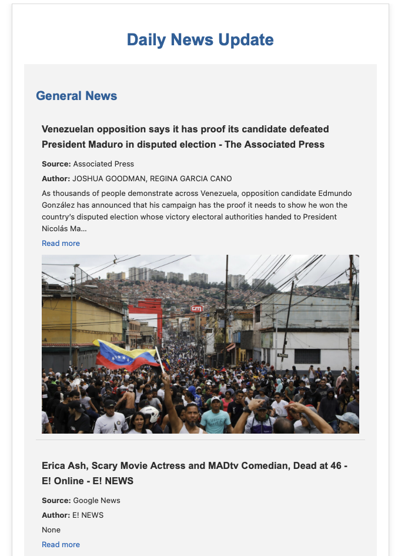
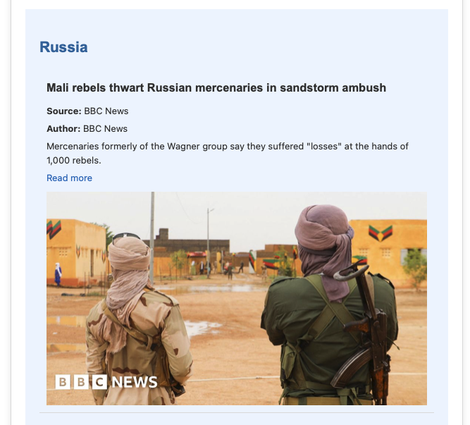

# Daily digest email

## a way to get my american news compiled overnight

I like to read my emails while drinking coffee in the morning. I have to play catch up with the American news that happened overnight (AEST timezone). Why not consolidate the two things and
make my life easier 

Provides generic news of the day : 

Combined with a specific customizable group of topics of interest

